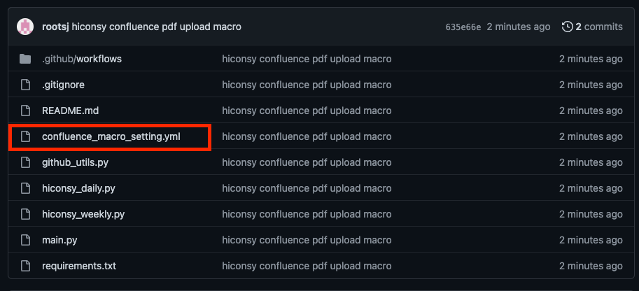
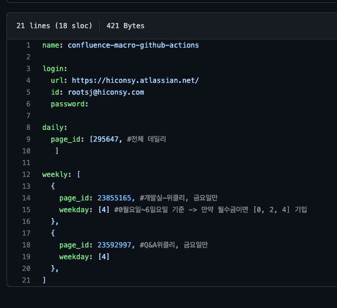
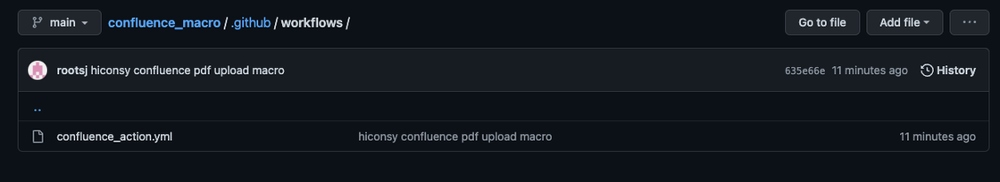
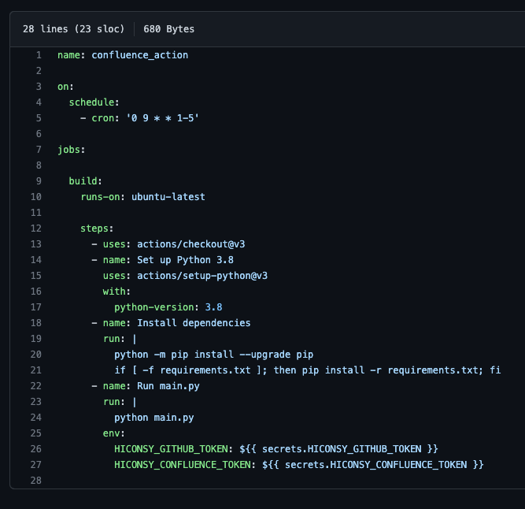

# confluence_macro

### 1. pdf 백업 양이 많고 누락되는 날짜 존재
### 2. 전체 Daily의 경우 ‘pdf 내보내기' 소요 시간만 현재(22/09/19) 약 1분 정도 소요됨
### 3. 매크로 구현 시 매크로 서버 리소스 문제 → Github Enterprise Actions으로 겸사겸사 해결
### 4. pdf 업로드 귀찮음

# 페이지 아이디란?


- pages 뒤의 숫자 295647

# 매크로 설정 방법
## confluence_macro_setting.yml



- 데일리 추가 방법

    daily: page_id:에 페이지 아이디 리스트 안에 추가 

    월~금 업로드됨

- 위클리 추가 방법

```
{
page_id: 23592997, #Q&A위클리, 금요일만
weekday: [4] 
},
```

위와 같은 형식으로 리스트 추가

weekday 0월요일 6일요일 기준으로 추가

ex) 월화수목 업데이트  [0, 1, 2, 3] 으로 표기

ex2) 금요일 [4]

- password: 

임시용 값으로 테스트 및, Secret값 설정 권한 없을 경우 token API 대용 입력값

## .github/workflows/confluence_action.yml




- 실행시간

    cron: 실행시간 UTC기준 (한국 +9시간) (UTC+09:00)

    데일리, 위클리 다 동일 시간 처리중(현재 18시 월-금 실행, 위클리는 해당 요일에만 실행 됨)

    구조상 18시 실행X 적게는 5~15분 길게는 몇시간 후 실행 될 수 있음

    현재 구조상 모든 업로드가 같은 스케줄로 실행 → 분리 가능은 함

- 환경변수

    에러 발생 시 → 토큰 만료 확인 필요

    - HICONSY_GITHUB_TOKEN

        깃허브 → setting → Developer Settings → Personal access tokens → Generate new token

    - HICONSY_CONFLUENCE_TOKEN

        프로파일 → 계정관리 → 보안 → API 토큰 , API 토큰 만들기 및 관리


# Confluence 라이브러리
https://github.com/atlassian-api/atlassian-python-api


# 환경설정
python 3.8

pip install -r requirements.txt

    atlassian-python-api
        - 컨플루언스 Rest API 라이브러리

    PyYAML
        - yaml 접근 라이브러리

    PyGithub==1.51
        - 깃허브 이슈 생성 용

    pytz==2019.1
        - 한국 시간 체크 용